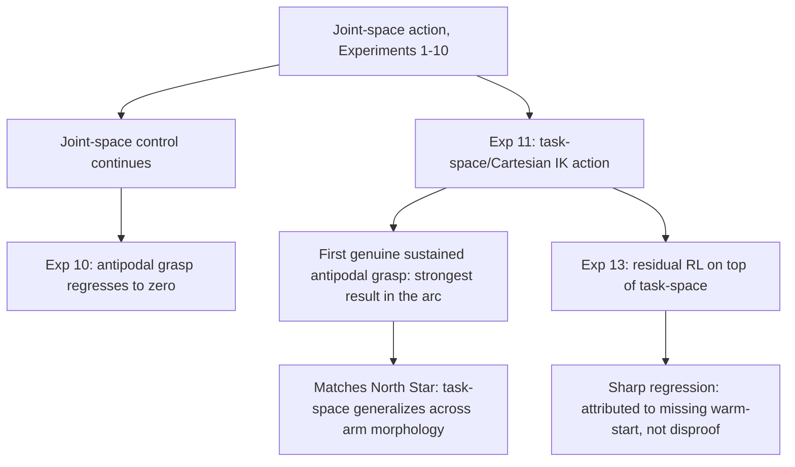

# Action-space design: joint-space vs. task-space/IK vs. residual

## The question

For the entire sphere-era and early cube-era of this project (Experiments 1
through 10), the policy's action space was direct joint-position deltas
(`JointPositionActionCfg`/`BinaryJointPositionActionCfg`), with IK used only
as a reward-shaping reference (comparing the achieved pose to an IK-computed
target), never as the action mechanism itself. Every reward-shaping,
curriculum, learning-rate, and physics-parameter variation tried on top of
that fixed action space (Experiments 1–10) failed to produce lift, and
[[experiment-10-antipodal-threshold-action-scale-solver]]'s own action-scale
test (`scale=1.0` → `0.5`, matching Franka's recipe) still produced zero
antipodal grasp signal — evidence that the bottleneck was precision of
gripper positioning under joint-space control specifically, not any
particular reward term.

## What changed when the action space changed

- **[[experiment-11-taskspace-ik]]**: replaced joint-space action with
  Isaac Lab's `DifferentialInverseKinematicsActionCfg` — the policy
  outputs Cartesian end-effector deltas, and IK converts them to joint
  targets *inside the control loop*, offloading "how to move 6 joints" to
  a classical solver so the policy only learns "where to go." This
  produced the project's first genuine, sustained antipodal grasp contact
  (`antipodal_grasp_bonus` 0.018815, nonzero 91.6% of iterations — every
  prior experiment had this at 0 or a tiny 0.0014 at best). This is the
  single strongest positive result in the whole session up to Experiment
  14.
- **[[experiment-13-residual-rl]]**: a further variant on task-space
  control — instead of the policy commanding the raw delta, it commands
  only a small correction on top of a classical proportional controller
  pursuing the active waypoint (Silver et al. 2018, Johannink et al. 2019).
  This regressed sharply (antipodal collapsed -98.9%, `cube_reached_goal`
  -44.2%) — but the regression is attributed to a specific, identified gap
  between this experiment's implementation and the cited literature (no
  warm-start period for the residual before joint actor/critic training),
  not to task-space control or residual RL as approaches in general.

## Interpretation

The clean signal is: **switching to task-space/Cartesian action was the
single highest-leverage lever tried in this entire arc**, more effective
than any of the ten reward/curriculum/optimization variations tried under
joint-space control before it. This is also the point where this project's
practice most directly matches the repo's own North Star (per `CLAUDE.md`):
task-space/Cartesian action formulations are explicitly named there as the
kind of choice that generalizes across arm morphology, versus hand-tuning
to one arm's specific joint geometry — and empirically, in this project's
own data, task-space action is also what worked best. The residual variant
on top of task-space control is a separate, still-open question — its
regression is explained by a missing implementation detail, not disproof of
the underlying idea, and retrying it with a proper warm-start remains an
untested, literature-motivated candidate.

## New-mechanism risk

Both new action-space experiments (11 and 13) introduced real
implementation risk when swapping the action term — see
[[ppo-critic-divergence]] for the specific bugs this surfaced.

## Related experiments

[[experiment-10-antipodal-threshold-action-scale-solver]], [[experiment-11-taskspace-ik]],
[[experiment-13-residual-rl]]
