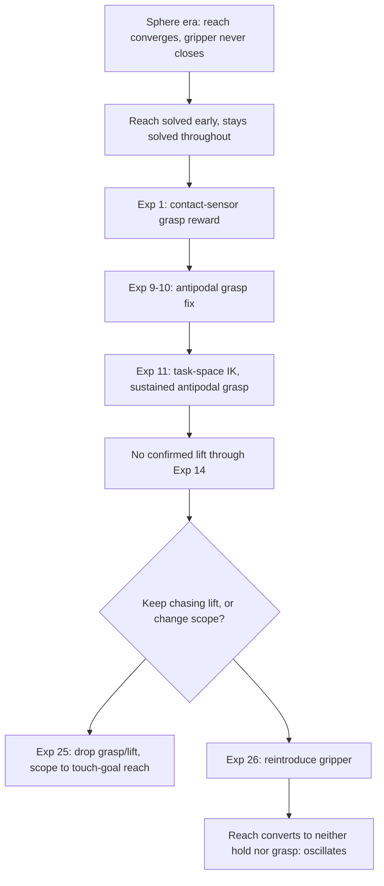

# The reach → grasp → lift staged-progress gap

## Why this is the through-line of the whole research arc

Every numbered experiment in this project's history (1 through 14, and the
unnumbered sphere-era precursors before Experiment 1) is, at bottom, an
attempt to close one specific gap: the policy reliably learns to **reach**
toward the object almost immediately, increasingly reliably learns to
**grasp** it (as ground-truth contact sensing and antipodal checks matured),
but has **never**, across 14 numbered experiments plus their unnumbered
precursors, been observed on video genuinely lifting, carrying, and placing
the object at a goal.

## The arc, stage by stage

1. **Pre-Experiment-1 (sphere, unnumbered):** reach converges (~0.92-0.93);
   the gripper approaches and then holds a static, open pose — it never
   even attempts to close. Four sequential reward-shaping hypotheses were
   tried and falsified before this article's numbered sequence begins. Two
   are covered in full detail in
   [[reward-hacking-and-sparse-discoverability]] (dense proximity+closure
   bonus: reward-hacked, the gripper closed beside the sphere not around
   it; multiplicatively-gated alignment bonus: structurally un-hackable but
   too sparse to ever be discovered). The other two, recorded here since
   they don't fit that article's reward-hacked-vs-sparse axis: a bounded
   **lift-weight bump** (the very first retargeting run, `lifting_sphere`
   weight 15.0→25.0 against an otherwise-unchanged baseline reward) produced
   results *identical* to the unmodified baseline —
   `reaching_sphere` ~0.92-0.93, `lifting_sphere`/`sphere_reached_goal` flat
   at 0.0000 in both runs — ruling out "the weight was simply too low"
   before any dense-shaping redesign was attempted; and a **gripper PD-gain
   rescale** (`stiffness` 1000.0→350.0, `damping` 50.0→30.0, preserving the
   original damping ratio, tested against the AR4 gripper's ~2.3-2.85x
   smaller scale than the Franka+DexCube reference recipe this repo's
   reward was copied from) also produced no change (`lifting_sphere` max
   0.0002, `reaching_sphere` ~0.94) — consistent with the literature-review
   correction that found the cited paper's stiff-gain warning applies to
   sim-to-real transfer, not pure in-sim PPO convergence (see
   [[citation-verification-practice]]). A fifth, non-reward-shaping
   precursor — training with the object-position observation replaced by a
   real perception-camera-derived estimate instead of privileged ground
   truth (`tasks/ar4/pickplace_single_object_env_cfg.py`,
   `scripts/_perception_adapter.py`) — was paused mid-run by user request at
   iteration 110/500 to pivot to the contact-sensor experiment below,
   surfacing a real infra-cost finding rather than a lift/no-lift verdict of
   its own: this project's own perception pipeline is plain serial numpy
   per-env (not GPU-batched), making camera-observed training ~2.7 hours per
   1500 iterations at `num_envs=16`, versus minutes at `num_envs=4096` for
   privileged observations (per-iteration sample count is also inherently
   ~256x smaller, so raising `num_envs` here buys no free parallelism). Full
   data:
   `docs/superpowers/specs/2026-07-05-ar4-single-object-camera-training-design.md`,
   `docs/superpowers/plans/2026-07-05-ar4-single-object-camera-training-report.md`.
2. **[[experiment-01-contact-sensor-grasp-reward]]:** the gap moves. Grasp
   is now real (~92% sustained bilateral contact) — but the arm freezes
   immediately after grasping, in all 10 inspected episodes. "Reach, grip,
   freeze" becomes this project's standing failure signature for the rest
   of the sphere era.
3. **[[experiment-02-curriculum-gated-lift-height]]** through
   **[[experiment-07-sphere-shrink]]:** six further hypotheses targeting
   lift specifically (curriculum timing, always-on dense lift reward,
   learning-rate bump, potential-based shaping, mirror-scene + stillness
   penalty, object-size shrink) — all falsified, none produce a real lift.
4. **[[experiment-08-classical-ik-guided-path]]** (spanning the sphere→cube
   pivot): a denser path-tracking reward completes training but its own
   data reveals *why* freezing is favored — a ~118:1 reward-rate imbalance
   (see [[reward-rate-arithmetic]]).
5. **[[experiment-09-antipodal-grasp-bonus]]** and
   **[[experiment-10-antipodal-threshold-action-scale-solver]]:** fixing the
   grasp-quality signal itself (magnitude-only → antipodal, see
   [[grasp-mechanics-antipodal-vs-magnitude]]) — antipodal contact
   regresses to exactly zero under joint-space control, implicating
   positioning precision, not reward design.
6. **[[experiment-11-taskspace-ik]]:** the single biggest positive result
   in the whole arc — switching to task-space/Cartesian IK-driven action
   (see [[action-space-design]]) produces the first genuine, sustained
   antipodal grasp. But the video signature is unchanged in kind: the arm
   still holds a low, static grasp pose and never lifts to height or
   carries toward the goal.
7. **[[experiment-12-stillness-reward-rate]]:** fixing a verified
   reward-rate bug in the new task-space reward produces a scalar-mixed,
   video-inconclusive result — still no confirmed lift.
8. **[[experiment-13-residual-rl]]:** a structurally different pivot
   (residual policy over a classical base controller) regresses, plausibly
   due to a missing literature warm-start step, not a disproof of the
   approach.
9. **[[experiment-14-reach-skip-curriculum]]:** removing reach from what
   the policy has to rediscover each episode (one-shot IK reset to a
   pregrasp pose) produces no improvement on the lift criterion, plus a new
   base-collapse failure mode in 2/3 inspected episodes.

## Where this stands at the end of this pass

As of Experiment 14, "pick up and move" — the project's actual stated
scope-in goal per `CLAUDE.md` — remains unachieved. Three consecutive
experiments (12, 13, 14) failed to move this specific needle, triggering
this project's own "escalate, don't keep tuning" mandate. The most-cited
still-untried candidate across multiple experiments' own "next steps"
sections is a genuinely different structural lever: **longer episodes
and/or explicit staged sub-objectives** (reach → grasp → lift → carry →
place as separate curriculum phases with their own success criteria, rather
than one flat episode/reward learning the whole sequence at once) — this
matches a standing note in this project's own working memory about future
AR4 iteration direction (longer episodes, staged decomposition, richer
drop-zone placement). Experiment 15 continues on the reward-rate axis
rather than this structural axis — see the next section for how that axis
plays out across ten further experiments.

## Experiments 15-24: the mechanism narrows, but the cube never leaves the ground

Ten further experiments continue directly from Experiment 14, each
targeting a progressively more specific candidate mechanism for the same
unresolved gap. None achieves a genuine, confirmed lift+carry; what changes
across this stretch is how precisely the failure gets diagnosed, not
whether it resolves.

- [[experiment-15-ground-penalty-base-proximity]] — direct reward-shaping
  additions (ground penalty, base-proximity penalty, raised antipodal/
  stillness weights) produce the best outcome-metric scalars of the arc so
  far, but the base-proximity penalty saturates in the wrong direction, and
  video shows the same base-collapse pattern as Experiment 14 a second time,
  under a structurally different mechanism.
- [[experiment-16-proven-recipe-replication]] — a from-scratch replication
  of two independently-proven Isaac Lab/IsaacGymEnvs recipes (ungraded
  grasp, lift-gated goal-tracking) initially appears to solve lift entirely;
  a same-day correction, prompted by the user directly challenging the
  video read, finds the cube wedged against the wrist/gripper housing,
  never gripped by the fingers — a wrist-wedging exploit, not a real grasp.
  Also confirms the gripper's two jaws are not mechanically coupled despite
  the source URDF's mimic constraint.
- [[experiment-17-antipodal-grasp-gate]] — gates the lift/goal-tracking
  reward on genuine bilateral antipodal contact, closing Experiment 16's
  exploit. The gate works exactly as designed (the one contact event it
  does see, it correctly rejects) but never fires across 1500 iterations —
  closing the exploit removed the only gradient the policy had found, and
  grasp+lift was never independently rediscovered.
- [[experiment-18-pregrasp-readiness-shaping]] — adds a dense proximity ×
  gripper-closedness shaping term on top of Experiment 17's gate. The new
  term is strongly learned (saturates), but `lifting_object` stays at
  exactly 0/1500 regardless — falsifies "missing gradient" as the
  bottleneck; readiness and lifting turn out to be decoupled.
- [[experiment-19-mimic-joint-physx-fix]] — a dedicated PhysX-level
  `PhysxMimicJointAPI` fix for the confirmed jaw-decoupling defect. Two
  independently-tested configurations both make jaw-position tracking
  measurably worse than the unfixed baseline — a clean falsification of
  this specific fix mechanism, not an inconclusive result.
- [[experiment-20-vertical-orientation-lock]] — constrains the gripper's
  approach toward vertical/top-down. The originally-designed hard IK
  pose-lock is independently found unstable (three fix attempts fail) and
  abandoned mid-experiment for a soft reward-bias term instead, which
  saturates cleanly — the strongest dense signal in the project's history —
  yet `lifting_object` still stays at exactly 0/1500, ruling out
  orientation-discovery as the bottleneck. A same-day instrumented
  follow-up finds a new, asymmetric failure signature: one jaw never
  contacts the cube at all.
- [[experiment-21-proximity-gated-gripper]] — hard-gates the gripper open
  during approach, closing only within 5cm of the cube. Resolves Experiment
  20's one-jaw-never-touches asymmetry (both jaws now register real contact
  force) but the two jaws still never contact simultaneously — narrows,
  rather than resolves, the open question.
- [[experiment-22-software-jaw-mirroring]] — replaces the falsified
  PhysX-level jaw fix with a software control-loop mirroring jaw2's target
  to jaw1's measured position. Verified genuinely active by three
  independent checks (despite near-identical training scalars to Experiment
  21, a real red flag investigated rather than dismissed), but exposes a
  new reactive-lag failure mode instead of eliminating the asymmetry.
- [[experiment-23-warmstarted-residual-rl]] — residual RL over a classical
  5-waypoint controller, this time with the literature-specified warm-start
  [[experiment-13-residual-rl]] was missing. The warm-start mechanism is
  independently verified genuinely working, and still `lifting_object`
  stays at exactly 0/1500 — falsifies "missing warm-start" as the
  explanation for Experiment 13's regression; the residual-over-classical-
  base paradigm itself appears to be a non-fit for this task.
- [[experiment-24-scripted-oracle-gate1]] — a non-learned scripted oracle
  meant to bootstrap demonstration-based learning stalls before reaching the
  grasp waypoint in nearly every episode; three architecturally distinct
  fixes fail, and root-cause diagnostics point to a genuine fixed point of
  the receding-horizon differential-IK control loop, independently echoing
  Experiment 20's own IK-instability finding via a completely different
  investigation path.

By Experiment 23, eight consecutive experiments (13, 17-23) spanning reward
shaping, grasp gating, orientation bias, proximity gating, jaw mirroring,
and warm-started residual RL had each targeted a different specific
mechanism and converged on the identical null — the point at which
demonstration/imitation bootstrapping (Experiment 24) became the most
concretely justified next direction, and ultimately the point at which the
project's response changed in kind rather than in mechanism (see the pivot
section below).

## A related but distinct instance: the same gap, on the classical (non-RL) path

ROADMAP.md item 9 (2026-07-09, not yet compiled as its own experiment
article; see [[sim-physics-fidelity]] for what that pass covered) surfaced
a version of this same reach-grasp gap that is worth distinguishing clearly
from everything above, because it did not arise from an RL training run at
all. Every numbered stage in this article so far is about a trained
policy's behavior; this finding is about a purely classical, closed-form-IK
pick-cycle demo (`scripts/interactive_joint_demo.py`, fixed wrist held at
q4=q5=q6=0) that had never previously been run with its own gripper
contact sensors enabled. Once instrumented, it showed exactly 0.0N contact
force on both jaws across every cycle tested - not a partial or near-miss
contact, a total miss: the gripper closes on empty space, with jaw
terminal positions varying cycle-to-cycle rather than showing the
consistent stopping position real contact would produce. A first
hypothesis (settle time silently halving in real duration when `sim.dt`
was halved earlier in the same pass, since the script counts raw substeps
rather than deriving wait time from `env.physics_dt`; see
[[sim-physics-fidelity]]'s writeup of this bug class) was tested, fixed
(commit `e00dd11`), and did not resolve the miss, ruling it out as the
cause.

This connects directly to ROADMAP.md item 8's classical-IK finding
(`scripts/grasp_demo_v2.py`'s DLS-polish-from-grid-search approach getting
the gripper visibly close to the cube but never achieving contact) - this
pass's contact-sensor instrumentation confirms that same "gets close but
doesn't reliably center the object between the open jaws before closing"
signature with ground-truth force data, rather than inferring it from video
frames or residual distance alone as item 8 did.

**Item 7: a purely classical (non-RL) IK-driven joint pipeline also can't
reliably reach the cube's grasp pose.** Prompted by revisiting Experiments
11-15 (whose scalar-only "promising" trends were never trustworthy on their
own — the same ungated-reward blind spot Experiment 16 later diagnosed) and
a direct redirect to verify basic classical joint driving first,
`scripts/grasp_demo.py` (dormant since this repo's earliest commits) was
rebuilt to solve IK once per waypoint via live simulator feedback rather
than a reactive per-step loop, fixing two real bugs along the way: a
stale-joint-state carry-over, and the same "unbounded IK Cartesian jump" bug
`scripts/oracle_rollout.py` independently found (a single DLS Newton step
toward a target tens of centimeters away produces unrealistic joint deltas;
fixed by bounding the per-round step to 0.05m). Bounding the step stopped
the residual from diverging (it was growing 0.35m→0.67m; bounded, it
improves 0.9m→0.33m instead) but it still plateaus well short of the cube —
verified via both logged telemetry and video-frame inspection, cube height
frozen at spawn throughout the lift/hold phases, gripper visibly separated
from the cube in every sampled frame. Both the pregrasp and grasp waypoints
(5cm apart) independently converged to nearly the identical stuck joint
configuration. This was, at the time, the fourth independent script/
mechanism (the original `classical_pickplace_demo.py` kinematic-singularity
stall, plus `oracle_rollout.py` and now `grasp_demo.py`, three
architecturally distinct attempts) to hit the same "converges partway, then
stalls" signature at/near this cube position, independent of RL and of
action-space formulation — this reading briefly supported a genuine-
unreachability hypothesis, refuted in item 8 below.

**Item 8: resolved — the stall was a DLS Newton-step local-minimum trap,
not genuine unreachability.** A direct forward-kinematics measurement
(`scripts/measure_reach_envelope.py`, no IK solver involved at all) proved
the cube target is comfortably within the arm's reach envelope (0.538m
max measured reach vs. 0.344m needed) — refuting item 7's unreachability
reading outright: an iterative solver's failure to converge is evidence
about the solver, not about the target's reachability. Seeding the proven
bounded-step DLS solve from a geometrically-aimed starting configuration
(`scripts/ik_seeded_start.py`, after empirically recalibrating a wrong
assumed joint_1-to-azimuth sign convention) barely helped, confirming the
DLS iteration itself gets trapped in a local minimum independent of
starting direction. A direct forward-kinematics grid search
(`scripts/ik_grid_search.py`, 625 points, no iteration, so it can't get
stuck in a local minimum the way DLS can) found a configuration within
3.5-6cm of the target; a DLS polish from that seed
(`scripts/ik_polish_from_grid.py`) closed it to 3.648cm before plateauing
again (the same bit-exact fixed-point signature as every prior attempt) —
DLS still can't fully close even a small, well-conditioned gap on its own.
`scripts/grasp_demo_v2.py` applied this grid-search-then-polish method to
both waypoints and ran the full phased pick/lift/hold/release sequence,
finding and fixing a second real bug along the way (phase-transition
interpolation using the previous phase's *intended* target as the next
phase's baseline instead of its *actual achieved* position — the
"correct-looking" fix, re-reading actual state each phase, made things far
worse, since this arm's actuators track a fixed commanded target much
better than a continuously-ramping one; reverted to direct
target-commanding per phase). Result: joint tracking improved to
~0.19-0.32 rad residual, and video shows the gripper genuinely close to the
cube for the first time this session (previously the cube sat completely
disconnected from the arm in every attempt) — but the cube still never
moves; the combined IK gap plus phase-tracking residual is still enough to
miss contact. Net: the classical joint-driving *reachability* question is
answered (yes, with the right method — direct measurement plus
grid-search-then-polish, not iterative DLS alone) — a full clean grasp+lift
is not yet achieved, and closing the remaining few centimeters (finer/
better-centered grid search, longer per-phase settle time, or re-solving
from the actual achieved state at each phase transition) was flagged as an
open next step, not pursued indefinitely in this pass. See
[[sim-physics-fidelity]] for the reusable "an iterative solver's failure to
converge is not evidence of unreachability — verify with a direct,
non-iterative measurement" methodology this item established, which item 9
then builds on with its own physics-fidelity verification pass.

The root cause of item 9's own zero-contact-force miss (above) is a
distinct, still-open question from items 7-8's reachability finding — item
9's classical demo (`interactive_joint_demo.py`) gets close enough (per
item 8's own resolution that the cube is reachable and the gripper can be
driven near it) but still misses contact entirely, which is a
grasp-approach-geometry question, not a reachability question. What's
confirmed so far is only that the miss is real, exactly zero (not
partial), and not explained by the settle-time bug.

## The pivot: dropping grasp/lift entirely, not fixing it again (Experiment 25)

Following directly on Experiments 15 through 24 above (see that section
and their own individual articles), this section records a genuinely new
kind of stage in this gap's history: for the first time, the response to
"grasp/lift still doesn't reliably work" was not another mechanism fix, but
a direct structural decision to remove the requirement.

By the time Experiment 25 was scoped (ROADMAP.md item 10, 2026-07-09), two
separate findings closed off "train `pickplace_mirror_env_cfg.py` from
scratch" as the next step, each on its own: **(a)** six consecutive prior
experiments (17-22) had each targeted a different angle on the same
underlying mechanical defect — the gripper's two jaws are not actually
mechanically coupled (the source URDF's `mimic` constraint is confirmed
unenforced by Isaac Sim's USD import) — and both a physics-level fix
(Experiment 19) and a software-level fix (Experiment 22) made it worse
rather than better; **(b)** `pickplace_mirror_env_cfg.py`'s own production
reward (`staged_milestone_bonus`, built on `_raw_lift_progress_mirrored`)
turned out to still combine reach/grasp/lift/goal as a plain **ungated**
weighted sum — precisely the exploitable shape Experiment 16 already
diagnosed (the wrist-wedging finding: a policy scoring well on a lift-
shaped reward while the cube was never actually gripped by the fingers at
all, confirmed only after the user directly challenged the controller's
own video read and a fresh instrumented rollout was run — see
[[sim-physics-fidelity]]'s discipline of verifying visual/behavioral claims
with real sensor data rather than eyeballed frames) — without Experiment
17's grasp-gating fix, which lives only in a separate env-cfg lineage
(`pickplace_graspgated_env_cfg.py`) that `pickplace_mirror_env_cfg.py` never
inherited.

Flagged to the user rather than trained blind against those two known
risks. The user's direct decision: stop attempting a seventh fix to the
same jaw-coupling defect, and stop reusing a reward shape already known to
be exploitable — instead, **drop grasp/lift from the task entirely**,
reducing scope to two-stage sequential end-effector reaching (touch the
cube's top, then reach a fixed goal point), leaning on the one sub-behavior
that has converged reliably (~0.92-0.95) across nearly every experiment in
this project's history, independent of reward or action-space design. See
[[experiment-25-touch-goal-reach]] for the full design and a second,
distinct finding this pivot surfaced on its own — a running-max reward
mechanism, sound for the lift task it was built for, turning out to be
unsound for this new pair of spatially-opposed stages (see
[[staged-reward-co-satisfiability]]), caught by review before any training
run.

This is a different kind of stage than 1 through 9 above: those are all
attempts to close the gap by finding the right mechanism; this is the first
point in the project's history where the gap itself was judged not worth
continuing to chase with the current object/gripper hardware and reward
family, at least for now. The North Star's broader manipulation goal is
unchanged, but this specific narrow phase's definition of success was
renegotiated rather than the mechanism retried an eighth time.

## A new stage: fast, accurate reach that never holds or converts to grasp (Experiment 26)

Every failure signature recorded above, across the sphere era, the cube
era, and Experiment 25's touch-goal reduction, involves a reach that either
stalls in place or continues into a real grasp attempt: the sphere-era
standing failure signature is "reach, grip, freeze" — a real reach followed
by a real grasp followed by a static hold; even the pre-Experiment-1
precursor and the multiplicatively-gated alignment-bonus freeze (item 1 and
item 6's sub-case above) show the arm reaching toward the object for
roughly the first second before locking into a static pose; Experiment 25's
own near-miss shows the arm reliably curling onto the cube and extending
most of the way toward the goal before stalling just outside tolerance. In
every one of these cases, the arm reaches once and then holds near that
reached state (whether or not it goes on to grasp).

[[experiment-26-gripper-reintroduction]] breaks that specific pattern.
Reintroducing the gripper (grasp/lift/carry/goal back in scope, composing
Experiment 21's proximity gate with Experiment 17's antipodal gate under a
4-stage extension of Experiment 25's monotonic staged-potential reward, per
ROADMAP.md item 11) produced a trained policy whose behavior was initially
misread twice — first (via sparse 3-second-interval frame sampling) as a
complete static freeze from step 1, then (via a separate investigation's
own instrumented rollout) as "reaches close and holds." A full per-step
`reach_dist` trace (`scripts/graspgoal_reach_trajectory_check.py`, every
10-100 steps across the full 1500-step/30s episode, 4 envs) resolved the
disagreement with real numbers: **the arm reaches genuinely and fast (from
~0.52m at reset to ~0.024-0.026m by step 20-30, i.e. 0.4-0.6s in), but does
not hold there — `reach_dist` then oscillates unpredictably between
roughly 0.04m and 0.6m for the remaining ~29 seconds, never restabilizing
near the cube and never crossing into `grasped`/`lifted` (both `False` for
all 4 envs at every sampled point, start to finish).** `cube_reached_goal`
stayed at exactly `0.0000` for the entire 1500-iteration run, and the one
nonzero reward component (`grasp_goal_milestone_bonus`) plateaued within
the first ~15 iterations and never moved again.

This is a new point on this gap's throughline, distinct from every prior
stage: the arm does reach quickly and accurately (this project's one
sub-behavior that had converged reliably, ~0.92-0.95, across nearly every
experiment in its history), but for the first time that reach does not
convert into either a hold or a grasp attempt — it dissolves into
directionless wandering for the rest of the episode. A plausible mechanism
is the reward's running-MAX reach-potential (see
[[staged-reward-co-satisfiability]]): once the single best approach is
achieved, it is permanently banked, so nothing in the reward
differentiates staying close from drifting away afterward, and with the
antipodal grasp gate apparently never satisfied, there is no further
outcome-relevant gradient for the remainder of the episode. Since the
arm-only, gripper-free `--touchgoal` task (Experiment 25) reliably
converges under the same physics/PPO setup, the regression specifically
implicates what changed with the gripper's reintroduction (action
dimension 7→8, observation dimension 24→31 via the new `grasp_state` term)
or the reward's lack of any incentive to *hold* a good reach once
achieved — not a general breakdown of this project's established reach
behavior. Not yet root-caused to a specific fix — see
[[experiment-26-gripper-reintroduction]] for the full result and
[[staged-reward-co-satisfiability]] for the reward mechanism this design
extends. **[[ar4-vs-franka-root-cause-comparison]]** (2026-07-20) is the
direct follow-up investigation into "not yet root-caused": it confirms
the jaw-mimic constraint was never enforced (three independent fix
attempts, all failed) and that this is a real, physical, AR4-specific
asset defect distinct from Franka's own working asset — but also finds
Experiment 26's own recorded verdict never cleanly separated that
explanation from the reward-design one named above, so this arc's true
final answer stayed confounded through the pivot decision itself.

## Related experiments

All 26 numbered experiments — this is the connecting narrative across the
entire sequence — from [[experiment-01-contact-sensor-grasp-reward]]
through [[experiment-14-reach-skip-curriculum]], then
[[experiment-15-ground-penalty-base-proximity]],
[[experiment-16-proven-recipe-replication]],
[[experiment-17-antipodal-grasp-gate]],
[[experiment-18-pregrasp-readiness-shaping]],
[[experiment-19-mimic-joint-physx-fix]],
[[experiment-20-vertical-orientation-lock]],
[[experiment-21-proximity-gated-gripper]],
[[experiment-22-software-jaw-mirroring]],
[[experiment-23-warmstarted-residual-rl]], and
[[experiment-24-scripted-oracle-gate1]] (see the "Experiments 15-24"
section above), then [[experiment-25-touch-goal-reach]], a later structural
pivot away from this gap rather than a further attempt to close it, and
[[experiment-26-gripper-reintroduction]], a new stage on the same
throughline: a fast, accurate reach that never holds or converts to grasp,
distinct from every prior stage's "reach, then hold or grasp-then-freeze"
pattern.
