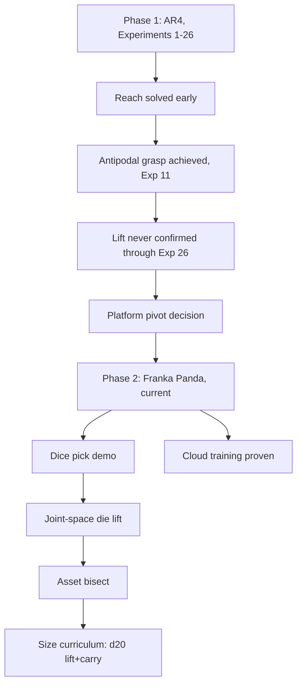

# Manipulation Research — Wiki (AR4 → Franka Panda)

This wiki compiles the research history of this repo's pick-and-place
manipulation project: the effort to get a simulated robot arm (Isaac Lab /
Isaac Sim) to reliably grasp an object and move it to a goal location via RL
(PPO). Per this repo's [North Star](../../CLAUDE.md), the long-term goal is
a general, reusable manipulation research platform — multiple tasks,
objects, and arms sharing the same infrastructure and, ideally, the same
methodology.

The work indexed here spans two phases. **Phase 1 (completed): the AR4
arm** — Experiments 1 through 26 below, one AR4 arm, one graspable object
(first a sphere, later a cube), pick it up and move it to a goal. Real
progress was made (reach solved, antipodal grasp contact increasingly
reliable) but a genuine lift-and-carry was never confirmed in evaluation
video, and mounting evidence (see Experiment 26 and the follow-up
investigations after it) pointed at AR4-asset-specific defects — an
unresolved 17-27mm classical-IK positioning miss, an unconfirmed gripper
jaw-mimic constraint, unverified jaw collision geometry — rather than a
fundamental RL/reward-design difficulty.

**Phase 2 (current): the Franka Emika Panda**, per the platform-pivot
decision recorded in [CLAUDE.md](../../CLAUDE.md) — built on a dedicated
`franka-panda-pivot` branch (2026-07-09 through 2026-07-13), then merged to
`main` by fast-forward on 2026-07-13. Franka is Isaac Lab's own officially-
supported reference manipulation platform, removing the custom-asset/
calibration risk class the AR4 work hit repeatedly. The pivot proved out
quickly: perception-driven dice picking (4/5 die types via a trained
detector), the first learned d20 die lift+carry at the real 30.3mm target
size, a proven GCP cloud training pipeline, and a detector-training win
(datagen-v2). The AR4-era investigations (IK positioning bug, jaw-mimic
defect, gripper contact geometry) are not abandoned — they may still matter
if this project returns to AR4, or as a concrete test of the North Star's
own "drop in a new arm, training should succeed immediately" bar once
Franka work matures — but are not the active priority while the Franka
phase is underway.

## Contents

- **Experiments** (`experiments/`) — one article per numbered experiment
  (Experiment 1 through Experiment 14), each with hypothesis, design,
  quantitative result, qualitative video finding, and verdict. Linked
  individually below.
- **Concepts** (`concepts/`) — cross-cutting themes that recur across
  multiple experiments, each synthesizing what's been learned about that
  theme across the whole arc rather than repeating it per-experiment.
  Linked individually below.

### Experiments (chronological)

1. [[experiment-01-contact-sensor-grasp-reward]] — ground-truth bilateral
   contact sensing replaces geometric grasp proxies; grip achieved, lift
   still doesn't emerge (sphere).
2. [[experiment-02-curriculum-gated-lift-height]] — dense lift-height term
   gated on at iteration 700; fired as designed, negligible real effect
   (sphere).
3. [[experiment-03-always-on-lift-height]] — same term active from
   iteration 0; still no lift, points at PPO entropy collapse (sphere).
4. [[experiment-04-sa-ppo-lr-bump]] — fixed learning-rate bump at the point
   the literature flagged as critical; no measurable improvement (sphere).
5. [[experiment-05-potential-based-reward-shaping]] — Ng/Harada/Russell
   potential shaping; a discount-handling bug made holding position
   actively costly (sphere).
6. [[experiment-06-mirror-scene-stillness-penalty]] — randomized spawn,
   mirrored goal, grasp-gated stillness penalty; a sign-convention bug
   found and fixed; no genuine lift (sphere).
7. [[experiment-07-sphere-shrink]] — shrink the sphere to test the
   aperture-margin hypothesis; falsified (sphere).
8. [[experiment-08-classical-ik-guided-path]] — live classical-IK
   path-tracking reward; completed on the cube after the sphere→cube
   pivot; its data exposes a 118:1 reward-rate imbalance that motivates
   Experiment 9.
9. [[experiment-09-antipodal-grasp-bonus]] — replaces magnitude-only
   contact reward with a geometric antipodal check, at a much lower
   weight; reward dominance reverses from grasp-favoring to path-favoring.
10. [[experiment-10-antipodal-threshold-action-scale-solver]] — physics-
    derived antipodal threshold, halved action scale, boosted solver
    iterations; antipodal signal regresses to exactly zero.
11. [[experiment-11-taskspace-ik]] — task-space/Cartesian IK-driven action
    replaces joint-space control; first genuine sustained antipodal grasp
    contact this project has seen, after fixing a critic-divergence bug.
12. [[experiment-12-stillness-reward-rate]] — fixes a verified reward-rate
    bug (net +1.0/step for freezing after grasp); result is scalar-mixed
    and video-inconclusive.
13. [[experiment-13-residual-rl]] — residual policy over a classical
    waypoint-seeking base controller; a genuine regression, likely missing
    the literature's warm-start step.
14. [[experiment-14-reach-skip-curriculum]] — one-shot IK reset to a
    pregrasp pose, skipping reach; no improvement on the success criterion,
    plus a new base-collapse failure mode.

*(Experiments 15 through 24 are not yet compiled into their own articles —
see the coverage boundary note below.)*

25. [[experiment-25-touch-goal-reach]] — direct user structural decision to
    drop grasp/lift entirely after six prior mechanism-fix attempts (17-22)
    failed and the task's own reward reintroduced Experiment 16's
    diagnosed wedging-exploit shape; reduces scope to two-stage sequential
    end-effector reaching. A pre-training review caught a running-max
    dead-zone defect before any training run; the actual training run
    itself has not yet been executed as of this pass.
26. [[experiment-26-gripper-reintroduction]] — reintroduces the gripper
    (grasp/lift/carry/goal back in scope), composing Experiment 21's
    proximity gate and Experiment 17's antipodal gate with a 4-stage
    extension of Experiment 25's monotonic staged reward and a 30s
    episode; falsified by a fast, accurate initial reach (~2.4cm by 0.5s)
    that never holds or converts to grasp — the arm instead oscillates in
    reach distance for the remaining ~29s of every episode, confirmed with
    a full per-step trajectory trace after two earlier, incomplete reads
    (a "complete freeze" from sparse visual sampling and a "reaches and
    holds" claim from a separate rollout) were each resolved against real
    numbers.

- [[dice-pick-demo]] (2026-07-11, unnumbered/scripted, `franka-panda-pivot`)
  — the dice + Franka + detection convergence milestone, met: commanded
  die type → trained detector identifies/localizes it among five dice →
  staged DiffIK picks the correct one, 4/5 die types passing (d4 the
  pre-declared permitted failure). First perception-in-the-loop pick on
  this platform; scripted controller, not RL — Phase I (detector state
  inside a trained policy) stays open.
- [[joint-space-die-lift]] (2026-07-12, `franka-panda-pivot`) — swaps
  Isaac Lab's validated Franka lift recipe from task-space IK to direct
  joint-position control, on the physics-baked 30.3mm d20 die; falsified
  on the d20 (0/8 sustained lifts), but proves the joint-space action
  formulation itself works (DexCube trains decisively under the same
  recipe) and isolates the failure to the d20 asset, not the action space.
- [[asset-bisect]] (2026-07-12, `franka-panda-pivot`) — one-variable-at-
  a-time ladder (mass → size → shape → pipeline provenance) isolates
  *shape* as the reliability gate for d20 grasp discovery: at identical
  size/mass/pipeline, a flat-faced cube trains 3/3 seeds vs. the rounded
  d20's 1/3; mass and this project's own bake pipeline both ruled out.
- [[size-curriculum]] (2026-07-13, `franka-panda-pivot`) — two pre-
  authorized size-curriculum arms (mixed-size domain randomization, then
  a staged 48.0→39.1→30.3mm anneal) both FALSIFIED as a fix for d20 grasp
  discoverability; the staged-anneal arm does prove the transfer
  mechanism itself works, yielding the project's first confirmed d20
  lift+carry at the real 30.3mm target size (seed 123, 8/8).
- [[unified-multi-die-specialist-distillation]] (2026-07-16 -> 2026-07-19,
  COMPLETE) — per-shape specialist + distillation + RL-fine-tune pipeline
  for a single policy that grasps a commanded die. Narrowed to d12/d20
  (d8/d10 genuinely null at every size/geometry tested, a real
  shape-specific barrier, not a confound). Final result: RL fine-tuning
  fully recovered a real BC/DAgger distillation regression (4/8 d20, 1/8
  d12) to an exact 8/8 match with each frozen specialist, both shapes —
  a working unified 2-shape policy, checkpointed. ≈$5.87 of the $15 cloud
  cap spent. Distractors/target-selection follow-on: see
  [[target-selection-clutter]].
- [[target-selection-clutter]] (2026-07-19, IN PROGRESS — Stage SO gate
  FAILED, stopped) — 3-die clutter curriculum (SO: 0 active distractors ->
  D1: 1 -> D2: 2) built on the above's finished single-object checkpoint.
  Stage SO (internal sanity gate, trained fully from scratch — new 43-dim
  schema incompatible with the 41-dim baseline checkpoint) got 0/8 both
  shapes, well below the >=7/8 gate; plan execution stopped before Stage
  D1/D2 per its own pre-registered discipline. No code bug found; the
  likely explanation is a confound between "did the new scene/observation
  code break something" (what the gate targets) and "does plain
  from-scratch PPO ever discover d12/d20 grasps without a distillation
  bootstrap" (a separate, pre-existing difficulty) — not yet resolved.

### Concepts

- [[reward-rate-arithmetic]] — the "grasp and freeze" bug class: net
  per-step incentive arithmetic that rewards holding a static state.
- [[action-space-design]] — joint-space vs. task-space/IK vs. residual
  action formulations, and what changed when the action space changed.
- [[ppo-critic-divergence]] — new-action-mechanism instability bugs
  (Experiments 11 and 13) and how they were diagnosed and fixed.
- [[grasp-mechanics-antipodal-vs-magnitude]] — magnitude-only bilateral
  contact vs. geometric antipodal/force-closure grasp checks.
- [[reach-grasp-lift-gap]] — the through-line of this entire research arc:
  reach is solved, grasp is increasingly solved, lift never emerges.
- [[reward-hacking-and-sparse-discoverability]] — the tradeoff between a
  dense reward term being exploitable and a correct term being too sparse
  to ever be found by exploration.
- [[citation-verification-practice]] — the recurring pattern of senior
  review catching fabricated or overstated citations in delegated
  literature research, across nearly every research pass this session.
- [[pi-as-primary-agent-gpu-dispatch]] — infra, not an RL experiment: the
  Pi became the primary agent host and routes GPU work to the desktop
  first, GCP cloud as fallback.
- [[sim-physics-fidelity]] — dt/decimation control-period-preserving
  changes, PhysX's opaque auto-compute collision offsets, EE-frame
  verification methodology, and the settle-time/dt coupling bug class
  (2026-07-09, post-dates the rest of this first pass — see the coverage
  boundary note below).
- [[staged-reward-co-satisfiability]] — running-max/potential-based staged
  rewards require stages that are co-satisfiable along one trajectory, not
  spatially opposed; the generalized lesson from Experiment 25's
  pre-training dead-zone catch (2026-07-09, also post-dates the rest of
  this first pass).
- [[asset-build-material-import]] — the shared AR4 USD asset rendered as a
  flat white silhouette because this Isaac Sim version's URDF importer
  discards per-visual `<material><color>` values (no ImportConfig flag
  controls it); fixed with a post-import color-authoring pass in
  `build_asset.py`, verified cosmetic-only (physics/robot layers byte-
  identical, EE offset re-checked) (2026-07-09, also post-dates this first
  pass).
- [[hyperparameter-registry]] — table-first, edit-in-place reference for
  every actively-tuned hyperparameter (physics/PPO/actuator/task-reward):
  current value, where it's set, why, what changed it last. Unlike the
  other concept articles, meant to be updated per-value as things change,
  not rewritten as narrative (2026-07-09, also post-dates the rest of
  this first pass).
- [[vision-platform]] (2026-07-10, `vision/` subtree) — the monorepo-
  merged former standalone Dice-Detection repo: synthetic-data generation,
  dataset plumbing, YOLO detector training/eval, ONNX export; the
  apparent-size-as-class-cue confound diagnosed in dice-detector-v1 and
  fixed by the datagen-v2 close-up slice, plus the d6 glyph-confound
  regression it exposed in turn.
- [[cloud-training]] (2026-07-13, re-verified 2026-07-14/15,
  `franka-panda-pivot`) — the GCP cloud training pipeline: proven
  end-to-end on a SPOT L4 instance (create → Isaac Sim/Lab pip install →
  headless training → GCS sync → teardown), install gaps found beyond
  NVIDIA's own docs, SPOT preemption/checkpoint-resume handling, and
  real per-SKU GCP pricing (the L4 GPU bills as a SKU separate from the
  `g2-standard-4` machine type).
- [[isaac-viewport-freezes]] (2026-07-13) — three distinct causes of an
  apparently frozen Isaac Sim viewport (only one a real bug: a rare
  mid-training livelock); the routine per-PPO-iteration UI stall and a
  demo-script synchronous-subprocess stall are both structural, not
  bugs. The window is not a training-health signal in either direction —
  watch the log-mtime heartbeat and TensorBoard instead.

## Scope of this first pass

This pass (compiled 2026-07-07) covers the numbered AR4 pick-and-place
experiments documented in `ROADMAP.md` through Experiment 14. **Not yet
covered** (per `kb/README.md`'s stated scope): the perception/shape-
classifier debugging saga, the LiDAR investigation, and the
literature-research docs under `docs/superpowers/specs/research/` beyond
what's cited from individual experiment/concept articles. Experiment 15 is
still training as of this pass and has no ROADMAP entry yet — not covered
here, to be added in a later pass. See `kb/README.md` for the wiki's
structure and conventions, and `ROADMAP.md` for the full, unabridged
chronological source record.

## Coverage boundary as of 2026-07-09

`ROADMAP.md`'s "Known follow-ups" section has grown substantially since the
2026-07-07 pass above — it now runs through item 11, covering (at minimum)
Experiment 24 Gate 1's scripted-oracle stall (item 6), the classical
(non-RL) IK reachability investigation (items 7-8), a 2026-07-09
physics-fidelity verification pass (item 9), Experiment 25's
touch-goal-reach structural pivot (item 10), and Experiment 26's gripper
reintroduction (item 11). **Items 6-8, and the numbered Experiments 15
through 24 that fall between this wiki's first pass and Experiment 25, are
not individually compiled into their own articles yet** — that backfill is
a separate, larger gap left for a future pass, not attempted here. Three
exceptions exist so far: item 9's physics-fidelity content (dt/decimation,
collision offsets, EE-frame verification methodology, and a settle-time/dt
coupling bug class) is covered in [[sim-physics-fidelity]], with item 9's
classical-IK contact-sensor finding cross-linked from
[[reach-grasp-lift-gap]]'s closing sections; item 10 (Experiment 25) is
covered in [[experiment-25-touch-goal-reach]], with its structural-pivot
narrative folded into [[reach-grasp-lift-gap]]'s closing sections and its
running-max dead-zone finding generalized in
[[staged-reward-co-satisfiability]]; and item 11 (Experiment 26) is covered
in [[experiment-26-gripper-reintroduction]], with its "fast reach that
never holds or converts to grasp" finding folded into
[[reach-grasp-lift-gap]]'s newest closing section as a new point on that
article's whole throughline. Silence on
items 6-8 and Experiments 15-24 here means "not yet compiled," not "nothing
happened" — see `ROADMAP.md` itself for the full record of those items in
the meantime.

## Coverage boundary as of 2026-07-15

The Franka-phase (Phase 2) content compiled so far is: [[dice-pick-demo]],
[[joint-space-die-lift]], [[asset-bisect]], [[size-curriculum]],
[[cloud-training]], [[vision-platform]], and [[isaac-viewport-freezes]] —
covering the perception-driven pick demo, the joint-space/asset-bisect/
size-curriculum experiment line on the d20 die, the GCP cloud training
pipeline (including its 2026-07-14/15 re-verification and per-SKU pricing
findings), the `vision/` monorepo subtree, and the viewport-freeze
diagnosis. **Not yet compiled**: the AR4-era gap already noted above
(items 6-8, Experiments 15-24) remains open, and no numbered "Experiment
27+" line has started for the Franka phase yet — its milestones so far are
unnumbered/scripted or object-property investigations rather than staged
RL experiments in the Tier-1 spec/plan sense. See `ROADMAP.md` for the full
Franka-phase record in the meantime.
