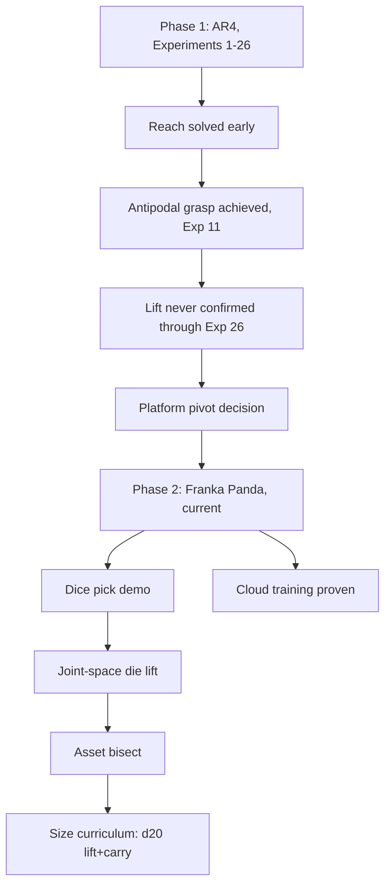

# Manipulation Research — Wiki (AR4 → Franka Panda)

This wiki compiles the research history of this repo's pick-and-place
manipulation project: the effort to get a simulated robot arm (Isaac Lab /
Isaac Sim) to reliably grasp an object and move it to a goal location via RL
(PPO). Per this repo's [North Star](../../CLAUDE.md), the long-term goal is
a general, reusable manipulation research platform — multiple tasks,
objects, and arms sharing the same infrastructure and, ideally, the same
methodology.

The work indexed here spans two phases. **Phase 1 (completed): the AR4
arm** — Experiments 1 through 26 below, one AR4 arm, one graspable object
(first a sphere, later a cube), pick it up and move it to a goal. Real
progress was made (reach solved, antipodal grasp contact increasingly
reliable) but a genuine lift-and-carry was never confirmed in evaluation
video, and mounting evidence (see Experiment 26 and the follow-up
investigations after it) pointed at AR4-asset-specific defects — a
classical-IK positioning miss, an unconfirmed gripper jaw-mimic
constraint, unverified jaw collision geometry — rather than a fundamental
RL/reward-design difficulty. **[[ar4-vs-franka-root-cause-comparison]]**
(2026-07-20) directly root-caused all three against the Franka setup:
the jaw-mimic finding holds up (confirmed never enforced, and Franka's
identical action-space mechanism needed no fix), the IK-miss claim was
real but overstated in its precision and was a classical-script/DLS
control-algorithm limitation rather than a URDF defect, and the
collision-geometry claim was never actually verified on either platform.
A direct 2026-07-21 follow-up (`ROADMAP.md`'s Task 7, also covered in
[[ar4-vs-franka-root-cause-comparison]]) tested whether Franka's own
confirmed grasp-discoverability fix (`RelativeJointPositionActionCfg`)
transfers back to AR4's historical null — **it does not (FALSIFIED,
H_ar4_relative)** — closing the AR4-vs-Franka investigation without a
positive transfer result and leaving the jaw-mimic-vs-actuator dynamics
conflict and the classical-IK positioning miss as the more likely
remaining explanations.

**Phase 2 (current): the Franka Emika Panda**, per the platform-pivot
decision recorded in [CLAUDE.md](../../CLAUDE.md) — built on a dedicated
`franka-panda-pivot` branch (2026-07-09 through 2026-07-13), then merged to
`main` by fast-forward on 2026-07-13. Franka is Isaac Lab's own officially-
supported reference manipulation platform, removing the custom-asset/
calibration risk class the AR4 work hit repeatedly. The pivot proved out
quickly: perception-driven dice picking (4/5 die types via a trained
detector), the first learned d20 die lift+carry at the real 30.3mm target
size, a proven GCP cloud training pipeline, and a detector-training win
(datagen-v2). The AR4-era investigations (IK positioning bug, jaw-mimic
defect, gripper contact geometry) are not abandoned — they may still matter
if this project returns to AR4, or as a concrete test of the North Star's
own "drop in a new arm, training should succeed immediately" bar once
Franka work matures — but are not the active priority while the Franka
phase is underway.

## Contents

- **Experiments** (`experiments/`) — one article per numbered experiment
  (Experiment 1 through Experiment 14), each with hypothesis, design,
  quantitative result, qualitative video finding, and verdict. Linked
  individually below.
- **Concepts** (`concepts/`) — cross-cutting themes that recur across
  multiple experiments, each synthesizing what's been learned about that
  theme across the whole arc rather than repeating it per-experiment.
  Linked individually below.

### Experiments (chronological)

1. [[experiment-01-contact-sensor-grasp-reward]] — ground-truth bilateral
   contact sensing replaces geometric grasp proxies; grip achieved, lift
   still doesn't emerge (sphere).
2. [[experiment-02-curriculum-gated-lift-height]] — dense lift-height term
   gated on at iteration 700; fired as designed, negligible real effect
   (sphere).
3. [[experiment-03-always-on-lift-height]] — same term active from
   iteration 0; still no lift, points at PPO entropy collapse (sphere).
4. [[experiment-04-sa-ppo-lr-bump]] — fixed learning-rate bump at the point
   the literature flagged as critical; no measurable improvement (sphere).
5. [[experiment-05-potential-based-reward-shaping]] — Ng/Harada/Russell
   potential shaping; a discount-handling bug made holding position
   actively costly (sphere).
6. [[experiment-06-mirror-scene-stillness-penalty]] — randomized spawn,
   mirrored goal, grasp-gated stillness penalty; a sign-convention bug
   found and fixed; no genuine lift (sphere).
7. [[experiment-07-sphere-shrink]] — shrink the sphere to test the
   aperture-margin hypothesis; falsified (sphere).
8. [[experiment-08-classical-ik-guided-path]] — live classical-IK
   path-tracking reward; completed on the cube after the sphere→cube
   pivot; its data exposes a 118:1 reward-rate imbalance that motivates
   Experiment 9.
9. [[experiment-09-antipodal-grasp-bonus]] — replaces magnitude-only
   contact reward with a geometric antipodal check, at a much lower
   weight; reward dominance reverses from grasp-favoring to path-favoring.
10. [[experiment-10-antipodal-threshold-action-scale-solver]] — physics-
    derived antipodal threshold, halved action scale, boosted solver
    iterations; antipodal signal regresses to exactly zero.
11. [[experiment-11-taskspace-ik]] — task-space/Cartesian IK-driven action
    replaces joint-space control; first genuine sustained antipodal grasp
    contact this project has seen, after fixing a critic-divergence bug.
12. [[experiment-12-stillness-reward-rate]] — fixes a verified reward-rate
    bug (net +1.0/step for freezing after grasp); result is scalar-mixed
    and video-inconclusive.
13. [[experiment-13-residual-rl]] — residual policy over a classical
    waypoint-seeking base controller; a genuine regression, likely missing
    the literature's warm-start step.
14. [[experiment-14-reach-skip-curriculum]] — one-shot IK reset to a
    pregrasp pose, skipping reach; no improvement on the success criterion,
    plus a new base-collapse failure mode.
15. [[experiment-15-ground-penalty-base-proximity]] — wires in
    `ground_penalty`, adds `base_proximity_penalty`, raises antipodal/
    stillness weights; best outcome-metric scalars of the arc so far, but
    the new base-proximity penalty saturates in the wrong direction and
    reproduces Experiment 14's base-collapse pattern under a structurally
    different mechanism.
16. [[experiment-16-proven-recipe-replication]] — from-scratch replication
    of two independently-proven Isaac Lab/IsaacGymEnvs recipes; initially
    read as the arc's first genuine lift, then CORRECTED same-day: the cube
    is wedged against the wrist/gripper housing, never gripped by the
    fingers. Also confirms the gripper's two jaws are not mechanically
    coupled despite the source URDF's mimic constraint.
17. [[experiment-17-antipodal-grasp-gate]] — gates lift/goal-tracking on
    genuine bilateral antipodal contact, closing Experiment 16's exploit;
    the gate works exactly as designed but never fires once across 1500
    iterations — exploration difficulty, not a gate bug.
18. [[experiment-18-pregrasp-readiness-shaping]] — dense pre-grasp-readiness
    shaping (proximity × gripper-closedness) on top of Experiment 17's gate;
    the term is strongly learned but lift stays at exactly 0/1500, falsifying
    the missing-gradient hypothesis.
19. [[experiment-19-mimic-joint-physx-fix]] — a real PhysX-level
    `PhysxMimicJointAPI` fix for the confirmed jaw-decoupling defect; two
    independently-tested configurations both make jaw-tracking measurably
    WORSE than the unfixed baseline.
20. [[experiment-20-vertical-orientation-lock]] — constrains the gripper's
    approach toward vertical/top-down; a hard IK pose-lock is found unstable
    mid-experiment and replaced with a soft reward-bias term, which
    saturates cleanly but lift still stays at 0/1500; surfaces a new
    asymmetric one-jaw-never-touches failure.
21. [[experiment-21-proximity-gated-gripper]] — hard-gates the gripper open
    during approach, closing only within 5cm of the cube; resolves
    Experiment 20's one-jaw asymmetry (both jaws now register contact) but
    the jaws still never contact simultaneously.
22. [[experiment-22-software-jaw-mirroring]] — a software control-loop jaw
    synchronization (jaw2 tracks jaw1's measured position) replacing
    Experiment 19's falsified physics-level fix; verified genuinely active,
    but exposes a new reactive-lag failure mode instead of eliminating the
    asymmetry.
23. [[experiment-23-warmstarted-residual-rl]] — residual RL over a classical
    5-waypoint controller with the literature-specified warm-start
    Experiment 13 was missing; the warm-start mechanism is independently
    verified genuinely working, and lift still stays at 0/1500.
24. [[experiment-24-scripted-oracle-gate1]] — Experiment 24 Gate 1: a
    non-learned reactive-differential-IK oracle meant to bootstrap BC
    pretraining stalls before reaching the grasp waypoint in nearly every
    episode; three architecturally distinct fixes fail; root-cause points to
    a genuine fixed point of the receding-horizon IK control loop.

25. [[experiment-25-touch-goal-reach]] — direct user structural decision to
    drop grasp/lift entirely after six prior mechanism-fix attempts (17-22)
    failed and the task's own reward reintroduced Experiment 16's
    diagnosed wedging-exploit shape; reduces scope to two-stage sequential
    end-effector reaching. A pre-training review caught a running-max
    dead-zone defect before any training run; the actual training run
    itself has not yet been executed as of this pass.
26. [[experiment-26-gripper-reintroduction]] — reintroduces the gripper
    (grasp/lift/carry/goal back in scope), composing Experiment 21's
    proximity gate and Experiment 17's antipodal gate with a 4-stage
    extension of Experiment 25's monotonic staged reward and a 30s
    episode; falsified by a fast, accurate initial reach (~2.4cm by 0.5s)
    that never holds or converts to grasp — the arm instead oscillates in
    reach distance for the remaining ~29s of every episode, confirmed with
    a full per-step trajectory trace after two earlier, incomplete reads
    (a "complete freeze" from sparse visual sampling and a "reaches and
    holds" claim from a separate rollout) were each resolved against real
    numbers.

- [[dice-pick-demo]] (2026-07-11, unnumbered/scripted, `franka-panda-pivot`)
  — the dice + Franka + detection convergence milestone, met: commanded
  die type → trained detector identifies/localizes it among five dice →
  staged DiffIK picks the correct one, 4/5 die types passing (d4 the
  pre-declared permitted failure). First perception-in-the-loop pick on
  this platform; scripted controller, not RL — Phase I (detector state
  inside a trained policy) stays open.
- [[franka-ik-dice-line-demo]] (2026-07-21, unnumbered/scripted demo) —
  classical IK-only pick, line-up, and relocate of all 5 dice; 8/10
  pick-and-place ops succeeded, d4 failed both attempts (well-documented
  hardest grasp case); found and fixed a cloud OOM-by-frame-buffering bug
  along the way.
- [[joint-space-die-lift]] (2026-07-12, `franka-panda-pivot`) — swaps
  Isaac Lab's validated Franka lift recipe from task-space IK to direct
  joint-position control, on the physics-baked 30.3mm d20 die; falsified
  on the d20 (0/8 sustained lifts), but proves the joint-space action
  formulation itself works (DexCube trains decisively under the same
  recipe) and isolates the failure to the d20 asset, not the action space.
- [[asset-bisect]] (2026-07-12, `franka-panda-pivot`) — one-variable-at-
  a-time ladder (mass → size → shape → pipeline provenance) isolates
  *shape* as the reliability gate for d20 grasp discovery: at identical
  size/mass/pipeline, a flat-faced cube trains 3/3 seeds vs. the rounded
  d20's 1/3; mass and this project's own bake pipeline both ruled out.
- [[size-curriculum]] (2026-07-13, `franka-panda-pivot`) — two pre-
  authorized size-curriculum arms (mixed-size domain randomization, then
  a staged 48.0→39.1→30.3mm anneal) both FALSIFIED as a fix for d20 grasp
  discoverability; the staged-anneal arm does prove the transfer
  mechanism itself works, yielding the project's first confirmed d20
  lift+carry at the real 30.3mm target size (seed 123, 8/8).
- [[unified-multi-die-specialist-distillation]] (2026-07-16 -> 2026-07-19,
  COMPLETE) — per-shape specialist + distillation + RL-fine-tune pipeline
  for a single policy that grasps a commanded die. Narrowed to d12/d20
  (d8/d10 genuinely null at every size/geometry tested, a real
  shape-specific barrier, not a confound). Final result: RL fine-tuning
  fully recovered a real BC/DAgger distillation regression (4/8 d20, 1/8
  d12) to an exact 8/8 match with each frozen specialist, both shapes —
  a working unified 2-shape policy, checkpointed. ≈$5.87 of the $15 cloud
  cap spent. Distractors/target-selection follow-on: see
  [[target-selection-clutter]].
- [[target-selection-clutter]] (2026-07-19 -> 2026-07-21, COMPLETE through
  Stage E1 — hypothesis PASSES at every stage tested) — 3-die clutter
  curriculum (SO: 0 active distractors -> D1: 1 -> D2: 2) built on the
  above's finished single-object checkpoint, testing whether curriculum +
  a new fixed-size zero-padded distractor-distance observation term
  (DexSinGrasp's `d_t^S`) preserves discovery under clutter with the
  reward function unchanged. Stage SO's original from-scratch attempt got
  a confounded 0/8 both shapes (indistinguishable from this project's own
  pre-existing cold-start difficulty, not a real defect); a lossless
  partial-weight warm start from the single-object checkpoint resolved the
  confound and passed cleanly (d12 8/8, d20 7/8). Stage D1 (1 active
  distractor) then Stage D2 (2 active distractors, the primary
  falsification check) both passed cleanly — **d12 8/8, d20 8/8 at Stage
  D2**, comfortably above the pre-registered 6/8 bar, no wrong-die grasp
  observed in any inspected video frame. ≈$1.35 of the $5 cloud-spend cap
  for Tasks 4-6. **Stage E1 (2026-07-21, 2->3 distractors, d12/d20 only)**
  extended D2's own checkpoint one more distractor via an additive K=3
  observation sibling + 2×2-grid scene topology + checkpoint warm-start —
  **PASSED again, d12 8/8, d20 8/8, an exact match to D2's own baseline
  with no observed wrong-die grasp**, ≈$0.59 of E1's own $2 cap. E2
  (3->4 distractors) and S1 (folding d8/d10 back in) remain future,
  separately-gated specs, not auto-started by E1's pass.
- [[d8-d10-demo-warmstart]] (2026-07-19 -> 2026-07-20, H1 COMPLETE —
  FALSIFIED both shapes) — tests whether BC-pretraining from one real
  scripted-grasp demonstration per shape, warm-starting an otherwise-
  unchanged full PPO fine-tune, unlocks grasp discovery for d8/d10 at the
  48mm-parity anchor where cold-start PPO was robustly null. **Result:
  0/24 both d8 and d10** (3 seeds x 8 envs each), independently
  re-derived from raw trajectories and confirmed by frame-by-frame video
  review — no partial signal in any seed. H2 (d12-specialist checkpoint
  warm-start) remains pre-authorized as the next rung, not yet run.
  ≈$4 of the $10 cloud-spend cap.
- [[exploration-bonus-grasp-discovery]] (2026-07-19 -> 2026-07-20, H1
  COMPLETE — SPLIT, not falsified) — tests whether a theoretically
  policy-invariant (GRM `D=1`) potential-based exploration bonus for
  gripper-closure attempts near the object unlocks d8 grasp discovery at
  the same 48mm-parity null. **Result: mechanism-level bar fires in seed
  123 (7/8 envs, frac=1.0 — real closure attempts sampled near the
  object), but behavioral bar stays 0/24 across all 3 seeds** — the
  spec's own explicitly pre-registered third outcome, not a plain
  pass/fail. TDD-verified to avoid Experiment 5's own "always >= 0"
  formula-sign bug, and confirmed at real-run scale to have done so (this
  checkpoint approaches and attempts closure, unlike Experiment 5's total
  freeze). Independently re-derived from raw arrays and confirmed by
  frame-by-frame video review. No code bug found. ≈$1.2 of the $3
  cloud-spend cap.
- [[d8-antipodal-grasp-quality]] (2026-07-20, dual action-space test,
  CLOSED — H_joint FALSIFIED, H_taskspace CONFIRMED) — tests
  exploration-bonus-grasp-discovery's own forward pointer: does porting
  AR4's antipodal/force-closure grasp reward (refit to Franka's real
  μ=0.5) onto d8's 0/24 null unlock sustained-lift discovery, under
  joint-space control (H_joint) and, separately, task-space/IK control
  (H_taskspace). **Result: H_joint's mechanism-level signal regresses to
  exact `0.0` in all 3 seeds and 0/24 behaviorally — an exact
  cross-platform replay of the AR4-era Experiment 10 regression. H_taskspace
  is confirmed, not falsified, but genuinely seed-heterogeneous: 1/3 seeds
  (123) a full, physically-verified 8/8 clean sweep; 1/3 (42) a marginal
  mechanism-only signal with no lift; 1/3 (7) a clean null.** Outcome-matrix
  Row 2 (falsified/confirmed) — the first cross-platform transfer of the
  AR4-era "action-space precision gates the antipodal mechanism" finding,
  but not a clean win: task-space control is necessary for the mechanism to
  ever become learnable on Franka/d8, not yet sufficient for reliable
  from-scratch discovery across seeds. d8 is now solvable via two
  independent, non-competing mechanisms — this result and
  [[d8-d10-demo-warmstart]]'s H2 warm-start (24/24, no antipodal reward at
  all) — that answer different questions (mechanistic vs. practical) and
  are not reconciled into one story. ≈$3.2 of the $6 cloud-spend cap.

### Concepts

- [[reward-rate-arithmetic]] — the "grasp and freeze" bug class: net
  per-step incentive arithmetic that rewards holding a static state.
- [[action-space-design]] — joint-space vs. task-space/IK vs. residual
  action formulations, and what changed when the action space changed.
- [[ppo-critic-divergence]] — new-action-mechanism instability bugs
  (Experiments 11 and 13) and how they were diagnosed and fixed.
- [[grasp-mechanics-antipodal-vs-magnitude]] — magnitude-only bilateral
  contact vs. geometric antipodal/force-closure grasp checks.
- [[reach-grasp-lift-gap]] — the through-line of this entire research arc:
  reach is solved, grasp is increasingly solved, lift never emerges.
- [[reward-hacking-and-sparse-discoverability]] — the tradeoff between a
  dense reward term being exploitable and a correct term being too sparse
  to ever be found by exploration.
- [[shape-classifier-perception-debugging]] — a separate, perception-side
  saga (not grasp/RL): the shape classifier misclassifying cube/rect_prism
  as "sphere" against real depth data, root-caused to real geometry (an
  oblique side-wall sliver), fixed structurally (3/4 shapes correct, a new
  wedge regression found), with a LiDAR side-investigation confirming
  RGB-D as the only viable modality in this stack.
- [[citation-verification-practice]] — the recurring pattern of senior
  review catching fabricated or overstated citations in delegated
  literature research, across nearly every research pass this session.
- [[pi-as-primary-agent-gpu-dispatch]] — infra, not an RL experiment: the
  Pi became the primary agent host and routes GPU work to the desktop
  first, GCP cloud as fallback.
- [[sim-physics-fidelity]] — dt/decimation control-period-preserving
  changes, PhysX's opaque auto-compute collision offsets, EE-frame
  verification methodology, and the settle-time/dt coupling bug class
  (2026-07-09, post-dates the rest of this first pass — see the coverage
  boundary note below).
- [[staged-reward-co-satisfiability]] — running-max/potential-based staged
  rewards require stages that are co-satisfiable along one trajectory, not
  spatially opposed; the generalized lesson from Experiment 25's
  pre-training dead-zone catch (2026-07-09, also post-dates the rest of
  this first pass).
- [[toy-kinematic-proxy-env]] — infra, not an RL experiment: a new
  CPU-only, physics-free `toy_env/` proxy environment (pure-kinematics
  N-link arm, 3 action modes, Gymnasium-compatible) for fast algorithm/
  action-space prototyping without GPU/cloud cost, built to test whether the
  real absolute-joint-vs-task-space training pathology
  ([[d8-antipodal-grasp-quality]]'s root-cause finding) is reproducible
  cheaply; explicitly a hypothesis generator, not a substitute for Isaac Sim.
- [[asset-build-material-import]] — the shared AR4 USD asset rendered as a
  flat white silhouette because this Isaac Sim version's URDF importer
  discards per-visual `<material><color>` values (no ImportConfig flag
  controls it); fixed with a post-import color-authoring pass in
  `build_asset.py`, verified cosmetic-only (physics/robot layers byte-
  identical, EE offset re-checked) (2026-07-09, also post-dates this first
  pass).
- [[hyperparameter-registry]] — table-first, edit-in-place reference for
  every actively-tuned hyperparameter (physics/PPO/actuator/task-reward):
  current value, where it's set, why, what changed it last. Unlike the
  other concept articles, meant to be updated per-value as things change,
  not rewritten as narrative (2026-07-09, also post-dates the rest of
  this first pass).
- [[vision-platform]] (2026-07-10, `vision/` subtree) — the monorepo-
  merged former standalone Dice-Detection repo: synthetic-data generation,
  dataset plumbing, YOLO detector training/eval, ONNX export; the
  apparent-size-as-class-cue confound diagnosed in dice-detector-v1 and
  fixed by the datagen-v2 close-up slice, plus the d6 glyph-confound
  regression it exposed in turn.
- [[cloud-training]] (2026-07-13, re-verified 2026-07-14/15,
  `franka-panda-pivot`) — the GCP cloud training pipeline: proven
  end-to-end on a SPOT L4 instance (create → Isaac Sim/Lab pip install →
  headless training → GCS sync → teardown), install gaps found beyond
  NVIDIA's own docs, SPOT preemption/checkpoint-resume handling, and
  real per-SKU GCP pricing (the L4 GPU bills as a SKU separate from the
  `g2-standard-4` machine type).
- [[isaac-viewport-freezes]] (2026-07-13) — three distinct causes of an
  apparently frozen Isaac Sim viewport (only one a real bug: a rare
  mid-training livelock); the routine per-PPO-iteration UI stall and a
  demo-script synchronous-subprocess stall are both structural, not
  bugs. The window is not a training-health signal in either direction —
  watch the log-mtime heartbeat and TensorBoard instead.
- [[ar4-vs-franka-root-cause-comparison]] (2026-07-20) — a dedicated
  read-only investigation root-causing the pivot's three named AR4
  defects against Franka directly: the jaw-mimic constraint confirmed
  never enforced (3/3 fix attempts failed) with a genuinely revealing
  structural finding (both platforms use the identical symmetric
  action-space mechanism — the defect is physical, not RL-design); the
  classical-IK grasp miss re-characterized as a DLS single-step
  local-minimum trap in standalone demo scripts, not a URDF/asset
  defect, with the "17-27mm" figure itself unsourced; and the jaw
  collision-geometry claim still unverified on both platforms. Also
  finds the project's own last AR4 result (Experiment 26) was never
  cleanly attributed to these defects rather than reward design.

## Scope of this first pass

This pass (compiled 2026-07-07) covers the numbered AR4 pick-and-place
experiments documented in `ROADMAP.md` through Experiment 14. See
`kb/README.md` for the wiki's structure and conventions.

## Coverage boundary as of 2026-07-09 — CLOSED 2026-07-22

`ROADMAP.md`'s "Known follow-ups" section grew substantially past this
first pass, through Experiment 24 Gate 1's scripted-oracle stall, a
classical (non-RL) IK reachability investigation, a physics-fidelity
verification pass, Experiment 25's touch-goal-reach structural pivot, and
Experiment 26's gripper reintroduction. **The gap this section used to
flag — Experiments 15 through 24, and the classical-IK investigation, not
yet individually compiled — was closed 2026-07-22** as part of the
ROADMAP/BACKLOG restructure
(`docs/superpowers/specs/2026-07-22-roadmap-backlog-restructure-design.md`):
Experiments 15-24 now each have their own article (see the numbered list
above), the classical-IK investigation is folded into
[[reach-grasp-lift-gap]] and [[sim-physics-fidelity]], and the perception/
shape-classifier debugging saga (also previously uncompiled, see
`kb/README.md`'s prior Status note) now has its own article,
[[shape-classifier-perception-debugging]]. Experiment 25 is covered in
[[experiment-25-touch-goal-reach]] and Experiment 26 in
[[experiment-26-gripper-reintroduction]], both cross-linked from
[[reach-grasp-lift-gap]]'s closing sections.

## Coverage boundary as of 2026-07-15

The Franka-phase (Phase 2) content compiled so far is: [[dice-pick-demo]],
[[franka-ik-dice-line-demo]], [[joint-space-die-lift]], [[asset-bisect]],
[[size-curriculum]], [[cloud-training]], [[vision-platform]], and
[[isaac-viewport-freezes]] — covering the perception-driven pick demo, the
classical-IK dice-line demo, the joint-space/asset-bisect/size-curriculum
experiment line on the d20 die, the GCP cloud training pipeline (including
its 2026-07-14/15 re-verification and per-SKU pricing findings), the
`vision/` monorepo subtree, and the viewport-freeze diagnosis. The
unified-multi-die-specialist-distillation, target-selection-clutter,
d8-d10-demo-warmstart, exploration-bonus-grasp-discovery,
d8-antipodal-grasp-quality, and ar4-vs-franka-root-cause-comparison
articles (all listed above) cover the rest of the Franka-phase record
through Task 7 (2026-07-21). See `ROADMAP.md` for current status.
